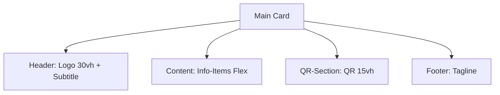

# PROYECTO:: Sistema de Presentación Digital PWA
****  
**Arquitectura:** Diseño Centrado en la Eficiencia (DCE)  
**Despliegue:** [https://tarjeta-arte.vercel.app/] (https://tarjeta-arte.vercel.app/)

## 1. Introducción
Este proyecto consiste en el desarrollo de una Progressive Web App (PWA) de alto rendimiento para moviles exclusivamente, 
diseñada para funcionar como una identidad digital profesional. La premisa técnica es la eliminación de la fricción entre 
el código y el usuario, logrando una interfaz minimalista soportada por una arquitectura de robustez interna.

## 2. Objetivos del Sistema
* **Disponibilidad Total:** Funcionamiento garantizado en entornos de baja o nula conectividad (Offline-First).
* **Optimización de Carga:** Consumo mínimo de recursos y renderizado instantáneo.
* **Adaptabilidad Geométrica:** Layout resiliente que utiliza el 100% del viewport dinámico sin desbordamiento (Zero-Scroll Policy).

## 3. Requisitos del Software
### 3.1 Requisitos Funcionales
* Acceso directo a redes sociales y canales de comunicación.
* Escaneabilidad de identidad mediante código QR integrado.
* Capacidad de instalación como aplicación nativa en dispositivos móviles(PWA).

### 3.2 Requisitos No Funcionales
* **Rendimiento:** Carga inicial en menos de 2 segundo.
* **Estética Ergonómica:** Diseño visual basado en la legibilidad y el orden jerárquico.
* **Ligereza:** Cero uso de frameworks pesados (Vanilla Tech).

## 4. Diseño Arquitectónico (UML)

### 4.1 Diagrama de Componentes (Estructura de la Interfaz)
Representa la jerarquía de los elementos visuales optimizados mediante unidades relativas `vh`.

